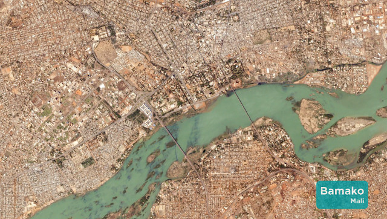

# World-vue

World-vue (pronounce world-view) provides a simple webpage
that rotates through pictures from the Planet.com gallery.
It displays the Title and Subtitle on each picture.
There is a basic opacity-transition between each picture.

Planet.com does not have CORS setup - therefore use get\_json.sh
to download the index.json that contains the Gallery data and remove
superfluous data.

